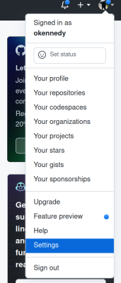
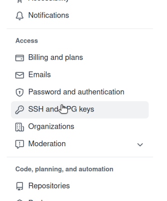

# Project 0: Setting Up

**Due: Friday 09/09/22 Before 11:59 PM**

**GitHub Classroom Invitation**: [https://classroom.github.com/a/PlrG3VFz](https://classroom.github.com/a/PlrG3VFz)

**Total Points = 0 (you must complete this assignment to get a passing grade)**

## Objectives

In this assignment, you will: 
* Set up your GitHub account (if necessary)
* Set your computer up to work with Git
* Confirm that Autolab is working for you
* Confirm that you are able to submit assignments through Git

## Useful Resources

* [Sign up for GitHub](https://github.com/signup)
* [Autolab](https://autograder.cse.buffalo.edu/courses/CSE250-f22/)
* [Git Documentation](https://git-scm.com/doc)

## Late Policy

Late submissions will not be accepted

## Instructions

1. Ensure you have a GitHub account ([click here if not](https://github.com/signup)).

2. Ensure that you have an SSH public/private keypair, and that it is registered with GitHub (see below)

2. [Accept the PA0 Assignment](https://classroom.github.com/a/PlrG3VFz).

3. Clone the PA0 repository (see below).

4. Edit `submission.txt` in the repository to contain your UB email address and your GitHub username, one per line, in that order.  For example, Dr. Kennedy's `submission.txt` would be:
```
okennedy@buffalo.edu
okennedy
```

5. Commit `submission.txt` and ensure that the repository is pushed to GitHub.  You can view the repository on the website to ensure that this is the case.

6. Submit the file submission.txt to [PA0 in Autolab](https://autograder.cse.buffalo.edu/courses/CSE250-f22/assessments/setup).


### The Command Line

Instructions in class assignments will require running commands from the command line.
You'll need to access the command line with a terminal (type `terminal` in MacOS's 
spotlight or the Ubuntu launcher).  You should see a command prompt.  For example: 
```
-bash-4.2$ 
```
You can type commands at this prompt.  Commands usually have the form
```
[command name] [argument 1] [argument 2] [argument 3] ...
```
Common commands include:
* `pwd`: Print the current working directory (usually starts as `/home/[username]`)
* `ls`: List all the files in the current working directory
  * Files and directories starting with a `.` (dot) are "hidden".  To show hidden files and directories as well, use `ls -a` 
* `cd [dirname]`: Move the current working directory to `[dirname]`.  
  * `.` is a special directory name that refers to the current directory.  E.g., if your current working directory is `/home/zaphod` then `cd .` wouldn't change the directory at all.
  * `..` is a special directory name that refers to the parent directory.  E.g., if your current working directory is `/home/zaphod` then `cd ..` would move the working directory to `/home`
  * `~` (tilde) is a special directory name that refers to your home directory (typically `/home/[username]`).
* `man [command]`: Read the manual page for `[command]`.
* `cat [filename]`: Display (con**cat**enate to the console) the contents of `[filename]`. 

A package manager is like an app-store for the command line.  Ubuntu uses `apt`. MacOS
does not have a built-in package manager, but there are several that you can 
install.  This course assumes that you are using [Homebrew](https://brew.sh).  To
install a piece of software, type:
* **Ubuntu**: `apt install [name of package]`
* **MacOS**: `brew install [name of package]`

To find the name of a package, you can use:
* **Ubuntu**: `apt search [keywords]`
* **MacOS**: `brew search [keywords]`

For this PA, you will need `git` installed.  This is the default on most platforms, but if you get `bash: git, command not found`, you should be able to install it with
```
apt install git # on Ubuntu
```
or
```
brew install git # on macos
```

### Git

Git is a [Version Control System](https://en.wikipedia.org/wiki/Version_control).  It allows you to keep track of changes to code, and 'sync' those changes to a server.  We will be using a Git hosting platform called GitHub.

Git is set up to manage "repositories", or directories of code.  It's decentralized, so you can have copies of the repository in a bunch of places.  Git shares code through a secure communications tool called SSH.  To log in to a server like GitHub, you'll need to generate a SSH public/private keypair.  The public part of this pair is like your name.  You upload this key to GitHub.  The private part of the pair should be kept secret, as it's used by SSH to identify you to GitHub's servers.


#### Setting up a Public/Private Keypair

You can find an overview of creating an SSH public/private key [in the GIT documentation](http://git-scm.com/book/en/Git-on-the-Server-Generating-Your-SSH-Public-Key).  After you follow the instructions there, you should have a file named `id_rsa.pub` (note the `.pub`, the file without that extension is the private part of the key and must be kept secret).  Open the `id_rsa.pub` file in a text editor.  It should look something like this:

```
ssh-rsa AAAAB3NzaC1yc2EAAAADAQABAAABAQDgX8jMmapRQ7pIJ0JV9zfvkqef/OBV//y3t0ceV5KaZ4DMlcn+xzonR/OR4cTuAyQRyQK3TlamleUATQe9JAieaI3dodnCfrN7C16RiqkB6iQorpCC+LdkdM7n3rVtleIAY93Imoq6tJEf+boeLz7EtB6I7OJSZ+NgRv5Z4vvF2hlgJrXaCr+ofURm/lLOHB1AdcZiXVL8tPOVl/FG170/i1fI+Y1eyQtko10XlHTHx4bGavYMsOKWoVjTBCruH8/VmiaUY7RBTn8Qg+yOQZPIOTrtWxRm0/Q373hKn8Xt+Dh38tHL3Z8X2C4jup/JFRmoT+nH6m9pB79IcnBNYa7V okennedy@sif
```

In [GitHub](https://github.com), find the "Settings" option in the menu in the upper-right-hand corner.



Find the "SSH and GPG Keys" option in the menu on the left.



Click "New SSH Key"


Paste the **contents of** the `id_rsa.pub` file into the input box and hit save.

#### Git Commands

Git is an incredibly powerful tool with a lot of options.  It is often convenient to use a GUI frontend (IntelliJ has one), but there are a few command-line commands that will help you, both in this class and in your future careers as computer scientists:

To retrieve a repository from a server, use `git clone [repositoryurl].  For example: 
```
git clone git@github.com:UB-Datastructures/fall2022-setup-exampleusername.git
```

Send your changes to a repository involves a few steps: 

1. Mark files you want to record as changed with `git add file1 file2 ...`
2. Commit your changes with `git commit` (this will bring up a text editor to record a message describing your changes
3. Upload your changes with `git push`

For example:

```
git add src/main/scala/cse250/MySubmission.scala
git commit # and then add some descriptive text
git push
```

It's often useful to commit even if you're not pushing.  A commit is a sort of checkpoint.  Git allows you to easily go back to an earlier commit, so this is useful as a way to back up your code before making destructive changes.
