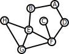

# Project 3: Maps and Driving Directions

**Tests Due: Monday 11/14/22 Before 11:59 PM**<br>
**Project Due: Monday 11/21/22 Before 11:59 PM**

**Advising (e.g., Piazza, Office Hours) may not be available over the weekend after 4:00PM on the Friday preceding the deadline. Plan accordingly**

**GitHub Classroom Invitation**: [https://classroom.github.com/a/ytjnsVv2](https://classroom.github.com/a/ytjnsVv2)

**Total Points = 30**

## Objectives

In this assignment, you will: 

* Learn how to use precomputation (i.e., an adjacency list structure) to 
  accelerate expensive operations.
* Implement route-finding based on Breadth First Search
* Implement route-finding based on Dijkstra's Algorithm
* Learn about applications of Queues and Heaps

## Useful Resources

Review the lecture notes and provided example code for some insight into the Scala 
syntax.  You will also want to read the Scala references provided below:

* [The Scala API](https://www.scala-lang.org/api/current/index.html)
  * [Scala Collections](https://docs.scala-lang.org/overviews/collections-2.13/introduction.html)
  * [scala.collection.mutable.Buffer](https://www.scala-lang.org/api/current/scala/collection/mutable/Buffer.html)
  * [scala.collection.mutable.Queue](https://www.scala-lang.org/api/current/scala/collection/mutable/Queue.html)
  * [scala.collection.mutable.PriorityQueue](https://www.scala-lang.org/api/current/scala/collection/mutable/PriorityQueue.html)
  * [scala.math.Ordering](https://www.scala-lang.org/api/current/scala/math/Ordering.html)
* [Scala Tour](https://docs.scala-lang.org/tour/tour-of-scala.html)
* [Scala Resources](https://docs.scala-lang.org/)
* [ScalaTest: Writing your first test](https://www.scalatest.org/user_guide/writing_your_first_test)

## Late Policy

The policy for late submissions on assignments is as follows.  Your project grade is the grade assigned to the latest (most recent) submission you make to autolab (or 0 if no submissions are made).

If your submission is made...

* ... prior to the deadline, your submission is assigned a grade of 100% of the points it earns.
* ... up to 24 hours after the deadline, your submission is assigned a grade of 75% of the points it earns.
* ... more than 24 hours after the deadline, but within 48 hours of the deadline, your submission is assigned a grade of 50% of the points it earns.
* ... more than 48 hours after the deadline, it will not be accepted.

**Starting with this assignment there are no bonus points will be awarded for early submissions.  (Early submissions are still encouraged, as Autolab gets congested close to deadlines)**

You will have the ability to use three grace days throughout the semester, and at most 
two per assignment (since submissions are not accepted after two days).  Using a grace 
day will negate the 25% penalty per day, but will not allow you to submit more than 
two days late.  Please plan accordingly.  You will not be able to recover a grace day 
if you decide to work late and your score was not sufficiently higher.  **Grace days 
are automatically applied** to the first instances of late submissions, **and are 
non-refundable**.  For example, if an assignment is due on a Friday and you make a 
submission on Saturday, you will automatically use a grace day, regardless of whether 
you perform better or not.  **Be sure to test your code before submitting**, especially 
with late submissions **in order to avoid wasting grace days**.

**Keep track of the time if you are working up until the deadline**.  Submissions 
become late after the set deadline.  Keep in mind that **submissions will close 48
hours after hte original deadline** and you will not be able to submit your code after 
that time.

## AI Policy Overview

As a gentle reminder, please re-read the academic integrity policy of the course.  I 
will continue to remind you throughout the semester and hope to avoid any incidents.

### What constitutes a violation of academic integrity?

These bullets should be obvious things not to do (but commonly occur):
* Turning in your friend's code/write-up (obvious).
* Turning in solutions you found on Google with all the variable names changed (should be obvious).  This is a copyright violation, in addition to an AI violation.
* Turning in solutions you found on Google with all the variable names changed and 2 lines added (should be obvious).  This is also a copyright violation.
* Use of Github Autopilot (should be obvious).  This is still in murky legal water, and may be a copyright violation, in addition to being an AI violation.
* Paying someone to do your work.  You may as well not submit the work, since you will fail the exams and the course.
* Posting to forums asking someone to solve assignment problems *(even if you do not receive the solution)*
* Accessing solutions to assignment problems.

**Note:** Aggregating every { stack overflow answer, result from google, other 
source } because you "understand it" will likely result in full credit on assignments
(if you are not caught), and then failure on every exam.  Exams don't test if you know
how to use Google, but rather test your understanding (i.e., do you understand the 
problem and material well enough to arrive at a solution on your own).  Also, other
students are likely doing the same thing, and then you will be wondering why 10 people
that you don't know have your exact solution.

### What collaboration is allowed?

There is a grey area when it comes to discussing the problems with your peers, and I 
do encourage you to work with one another to discuss course *concepts* related to 
an assignment.  That is the best way to learn and to overcome obstacles.  At the same 
time, you need to be sure you do not overstep and not plagiarize.  Discussions pointing
to relevant course materials are OK.  For example, the following is acceptable advice:

> It would be helpful to review the usage of the stack in the recitation slides from
> week XX.

When working with your peers, we ask that you include attribution; In the header 
comment of the Main function of your submission, please list all peers who you have
discussed the project with.

Explaining every step in detail and/or giving pseudocode that solves the problem
is **not ok**.  For example, the following is **not acceptable** advice:

> I copied the algorithm from the week XX notes into my code at the start of the
> function, created a function that went through the given data and put it into a list, 
> called that function, and then sorted the results.

The first example is OK.  The second example, however, is a summary of your code and
is not acceptable.  Remember that you should never show any of your code to other 
students prior to any deadlines.  Regardless of where you are working, you must always
follow this rule: **Never come away from discussions with your peers with any written
work, either typed or photographed, and especially do not share or allow viewing of
your written code**. 

If you have concerns that you may have overstepped or worked too closely with someone,
please address this with me prior to deadlines for the assignment.  **Even if you have
submitted an assignment that may have violated the course academic integrity policy,
if you approach me *prior to detection* you will not face academic integrity 
proceedings**.  We will address options at that point.

### What resources are allowed?

With all of this said, please feel free to use any { files | examples | tutorials } 
that course staff provides, directly in your code.  Feel free to directly use any
materials from lecture or recitations.  You will never be penalized for doing so,
but must always provide attribution/citation for where you retrieved code from. Just
remember, if you are citing an algorithm that is not provided by us, then you are 
probably overstepping.  

More explicitly, you may use any of the following resources (with proper 
citation/annotation in your code: 
* Any example files posted on the course webpage or Piazza (from lecture or recitation)
* Any code that the instructor provides
* Any code that the TAs provide
* Any code from the [Tour of Scala](https://docs.scala-lang.org/tour/tour-of-scala.html)
* Any code from [Scala Collections](https://docs.scala-lang.org/overviews/collections-2.13/introduction.html)
* Any code from [Scala API](https://www.scala-lang.org/api/2.13.0/)
* Additional references may be provided as the semester progresses, but only those provided publicly by course staff are allowed for use.  These will be listed on Piazza under Resources

**Omitting citation/attribution will result in an AI violation** (and lawsuits later 
in life at your job).  This is true, **even if you are using provided resources**.

Again, **if you think you are going to violate/have violated this policy, please come
talk to a member of the course staff ASAP so we can figure out how to get you on track 
to succeed in the course**.  If you have a question about the validity of a resource, 
please ask a TA or your instructor prior to using it.  If you have already used it, 
please discuss with the instructor to determine a workaround and, at the very least,
avoid an academic integrity infraction.  For example, you might send an email such
as the following to the course instructor:

> Clarus T Example<br/>
> **UBIT**: ctexamp<br/>
> **Person** #: 123456789
> 
> Dear Dr. Kennedy/Mikida,
> 
> I believe that I may have submitted work that is *{ not fully my own | not properly
> attributed }*.  I wish to retract my submission to preserve academic integrity in
> the course.
> 
> Signed,<br/>
> &nbsp;&nbsp;Clarus T Example

This policy on assignments is here so that you learn the material and how to think 
for yourself.  There is no cognitive benefit achieved by submitting solutions someone
else has written (which likely already exist in some form).

## Collaboration Policy

The policy for collaboration on assignments is as follows:

* All work for this course must be original individual work.
* You must follow the limits on collaboration as defined in the AI policy (i.e., no shared code/etc...)
* You must identify any collaborators (first and last name) on every assignment.  This can be in a comment at the top of your code submissions or on the first page at the top of your written work, beside your name.

All references must be cited using a comment containing a direct link to the resource, 
as well as a brief description of what was used.  For example, if you reference the 
textbook, a page number and description is sufficient.  If you copy example code from 
the Scala Language API, then include the link to the class page within the API as well
as where the example code resides.

----

## Instructions

Answer the following questions by:

1. Accept [The PA3 Assignment in GitHub Classroom](https://classroom.github.com/a/ytjnsVv2).
2. Use the template repository and develop several test cases as detailed below.
3. Commit **and push** your answers to GitHub
4. Submit PA3-Tests in Autolab (note: Submissions open by Nov 2).  Repeat 2-4 as needed.
5. Implement the `???` placeholders in `MapUtils.scala`
6. Commit **and push** your answers to GitHub
7. Submit PA3-Implementation in Autolab (note: Submissions open by Nov 9).  Repeat 5-7 as needed.
8. After the deadline, an additional round of tests will be conducted on your implementation for the final 5 points.

Make sure your submission is committed and pushed into your GitHub Classroom Git repository. 
Seriously, make sure it's committed.  Yeah you... the person who clicked submit without checking.

**Expect this project to take 10-12 hours of setting up your environment, reading 
through documentation, and planning, coding, and testing your solution.**

Once you have the project passing the provided tests, you are encouraged to invoke `sbt run` in the project directory from a unicode-capable terminal (e.g., the 220 VM's default terminal or most other Linux terminals, or the MacOS Terminal.app).  For best results, use a font with color emoji glyphs (e.g., `noto-color`). 

### Overview

In this assignment you will implement a set of tools for computing directions
between intersections in downtown Buffalo.  Specifically, you will implement 
`MapUtils`, which includes the construction of an adjacency list, and two
different implementations of graph traversal that compute shortest paths between
locations according to two different metrics.

#### Graph Traversals

Recall that we discussed several forms of graph traversal in class, using 
different data structures to control the order in which newly visited vertices
are explored. Specifically, we considered:

- Depth First Search (DFS), which uses a `Stack`; Vertices adjacent to the most
recently explored vertex are explored first.
- Breadth First Search (BFS), which uses a `Queue`; Vertices are explored in the
order in which they are discovered.

We also considered a variant of Breadth First Search, where we explore vertices
according to some sort of priority order, through a `PriorityQueue` (e.g., one
based on a `Heap`).  For example, in a map, we might assign a "cost" to each 
edge like the physical distance one needs to travel to cross it.  Dijkstra's 
Algorithm is a `PriorityQueue`-based path traversal that assigns a higher 
priority to edges "closer" to the origin vertex.

#### Shortest Path

Recall that BFS (and analogously Dijkstra's Algorithm) visit vertices in order
of increasing number of hops (respectively distance) from the source.  This 
means that the first time the algorithm visits any given vertex, it will have
done so via the shortest path.  For example, take the following graph:



Exploring the graph, starting from (C) using BFS, you'd get a trace along the lines of:

* enqueue C (mark C visited)
* dequeue C 
  * enqueue C, F (mark F visited)
* dequeue C, F
  * enqueue C, F, D (mark D visited)
  * enqueue C, F, E (mark E visited)
  * enqueue C, F, G (mark G visited)
* dequeue C, F, D
  * enqueue C, F, D, A (mark A visited)
* dequeue C, F, E
  * enqueue C, F, E, B (mark B visited)
  * enqueue C, F, E, H (mark H visited)
* dequeue everything else

The computation only needs to proceed until a path is found to the target 
vertex.  For example, if you are looking for a path to G, the computation can 
stop before the 5th enqueue, since you now have the shortest path to G (C, F, G)

#### Priority Queues

Scala provides an [implementation](https://www.scala-lang.org/api/current/scala/collection/mutable/PriorityQueue.html)
of the `PriorityQueue` ADT based on a binary heap.  `PriorityQueue` supports
the standard ADT operations, including `enqueue`, `dequeue`, and `length`.  

`PriorityQueue` must be defined with an [`Ordering`](https://www.scala-lang.org/api/current/scala/math/Ordering.html).
Scala will automatically try to find an ordering that 'fits' the base type of, 
the `PriorityQueue` but you can also provide one manually.  An example of an
ordering is given in `Path.scala`, and you can use it to create an empty 
PriorityQueue with:

```
val queue = PriorityQueue[Seq[Edge]].empty(Path.decreasingPathDistanceOrder)
```

Alternatively, you can define your own for any type `T`

```
val queue = PriorityQueue[T].empty(
  new Ordering[T] {
    def compare(x: T, y: T): Int =
    {
      if(x is less than y){ return -1 }
      if(y is less than x){ return 1 }
      return 0
    }
  }
Path.decreasingPathDistanceOrder)
```

#### Street Graph

Input to most operations in this assignment will be passed via an instance of the `StreetGraph` class. There are two useful instance fields:

* `graph.intersections` : A collection of street intersections, organized by the intersection's identifier. An `Intersection` consists of an identifier, and a pair of geospatial coordinates. You can find the (approximate) distance in km between two `Intersection`s `a` and `b` by calling `a.distanceTo(b)`
* `graph.edges` : A collection of edges between intersections (i.e., street segments). Assume that edges for segments of streets with two-way traffic are present in both directions (i.e., if traffic flows both ways on "W Tupper Street", then there is an edge from "W Tupper Street and Delaware Ave" to "W Tupper Street and Franklin Street", as well as the back edge. An Edge object contains two intersection identifiers (see `graph.intersections`) for the from and to intersections it connects (remember, these are `directed` edges), as well as the name of the street.

An example data file (as passed to `StreetGraph.load`) is provided in `data/buffalo_map.xml`. This file follows the standard [OpenStreetMap XML format](https://wiki.openstreetmap.org/wiki/OSM_XML). Feel free to  download your own examples from OSM, or create your own.

#### `List`: An Immutable Linked List

Scala's [`List`](https://www.scala-lang.org/api/current/scala/collection/immutable/List.html) class implements a linked list that is **immutable** and **singly linked**.  As we discussed in the first week of classes, immutability means that the value of the class can not change once it has been allocated.  

In the case of a linked list, immutability gives us an interesting benefit: The tail of the linked list can be safely shared between multiple linked lists.  For example, consider the lists: 

1. M, N, D, C, B, A
2. E, D, C, B, A
3. P, Q, C, B, A

Since all of these lists share their tails, we can avoid duplication (or unnecessary copies) by keeping only one copy of the shared tail as follows:

<center>

</center>

Immutability forces most linked list operations (insert, append, remove, update) to copy all preceding elements, making these operations $O(n)$.  However, since the head has no preceding elements, operations on the head (prepend, removeHead) remain $O(1)$.  

Notably, `List` defines the following operations:

```scala
Nil         // An empty list (O(1))
x :: Y      // The List Y with element x prepended (O(1))
Y.head      // The head element of List Y (O(1))
Y.tail      // List Y, excluding its head element (O(1)); analogous to Y.remove(0)
```

---
### Part 1. Testing (5 points)

For this part, modify the file `MapUtilsTests.scala` to include new test cases. 

Your test cases will first be run against a correct implementation of 
`MapUtils`.  To get any points on this part, your tests will need to pass on 
this implementation.

Your test cases will then be run against several broken implementations of 
`MapUtils`.  You will get points for each broken implementation that you fail.

### Part 2. Implementation (20+5 points)

For this project, you will need to implement the following methods:

---

```scala
  def computeOutgoingEdges(
    graph: StreetGraph
  ): mutable.Map[String, mutable.Seq[Edge]]
```


The output of this function should be a Map containing an entry for every 
`Intersection` identifier that appears in the `from` field of at least one 
`Edge` in the graph's edges field.

* The key for this entry should be the identifier of the intersection
* The value for this entry should be a collection of every `Edge` who's `from` 
  field is equal to the key.

This function should run in $O(∣\texttt{graph.edges}∣)$

---

```scala
  def pathWithFewestIntersections(
    graph: StreetGraph,
    outgoingEdges: mutable.Map[String, mutable.Seq[Edge]],
    from: String,
    to: String
  ): Seq[Edge]
```

This function should return any path between the intersection with identifier `from`, to the intersection with `to`.  The returned path should contain the fewest path segments possible.  

The `outgoingEdges` argument is the result of calling your `computeOutgoingEdges` function on `graph`.

This function should run in 
$O(∣\texttt{graph.intersections}∣ + ∣\texttt{graph.edges}∣)$

---
```scala
  def pathWithShortestDistance(
    graph: StreetGraph,
    outgoingEdges: mutable.Map[String, mutable.Seq[Edge]],
    from: String,
    to: String
  ): Seq[Edge]
```

This function should return any path between the intersection with identifier `from`, to the intersection with `to`.  The returned path should contain path segments who's distance sums up to the smallest distance possible.

The `outgoingEdges` argument is the result of calling your `computeOutgoingEdges` function on `graph`.

This function should run in 
$O(∣\texttt{graph.intersections}∣ + ∣\texttt{graph.edges}∣)$

---

### Suggested Approach

Set up your GitHub Classroom repository as detailed above and set up your 
programming environment as you did in PA1.

Review the **Implementation Objectives** section and identify ways in which the 
code might fail.  Define test cases that test for these and submit them for 
Part 1.

Start with `computeOutgoingEdges`.  You are encouraged to carefully review the 
documentation on Scala's [Seq](https://www.scala-lang.org/api/current/scala/collection/Seq.html) 
type.  An hour spent reviewing documentation for what has already been 
implemented in a language can often help you avoid several days of 
implementation and debugging something that already exists.

Second, implement `pathWithFewestIntersections`.  Consider how best to make use 
of the `outgoingEdges` map you precomputed in the prior step to stay within the 
runtime bounds for this method.  Also, pay close attention to the expected 
runtime bounds for this function.  You are encouraged to consider how you can 
represent intermediate paths as a `List` to avoid a $O(|path|)$ factor creeping 
into your runtime.

You may find it helpful to use either `Tuple`s or define helper classes (in the 
`MapUtils.scala` file) to store intermediate state.

Finally, implement `pathWithShortestDistance`.  You will need to define your own
comparator.  If you feel comfortable with scala's `Comparable` class, go ahead 
and use that.  If not, see the `PriorityQueueHelper` object for a convenient 
constructor wrapper. 

**Keep in Mind**: Using a priority queue can guarantee that you wil only visit 
intersections in order of increasing distance from the root, but it's important 
to keep in mind that the standard graph traversal algorithm that we discussed in
class will **not** insert intersections in ascending order of distance.  Keep 
that in mind when deciding how to keep track of intersections that your 
algorithm has already visited.

For example, if you have a helper class for temporary state called 
`PotentialPath`, with a distance field named `distance`, you could allocate a 
priority queue as follows:

```scala
val queue = PriorityQueueHelper.create[PotentialPath](
  (a, b) => Ordering[Double].compare(b.distance, a.distance)
                // flip a and b to dequeue the smallest element first.
)
```

MapUtils defines a `nameOfIntersection` method that you might find helpful. You 
might also find an online map like [Bing Maps](https://maps.bing.com) or 
[Google Maps](https://maps.google.com) helpful for debugging your routefinding.

### Allowed library/container usage

* You may use any container in the scala.collection or scala.collection.mutable packages.
* You may use the scala.xml library.

## Submission

For **Project 3** you may submit as many times as you want.  Your final score will be the last (most recent) submission


## Revision History
* Fall 2022 - Oliver Kennedy (okennedy@buffalo.edu), Eric Mikida (epmikida@buffalo.edu)
